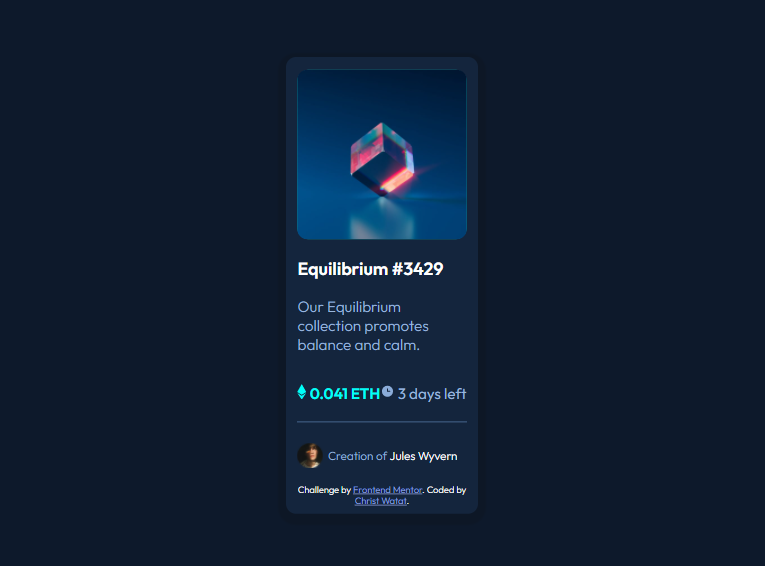

# Frontend Mentor - NFT preview card component solution

This is a solution to the [NFT preview card component challenge on Frontend Mentor](https://www.frontendmentor.io/challenges/nft-preview-card-component-SbdUL_w0U). 

## Table of contents

  - [The challenge](#the-challenge)
  - [Screenshot](#screenshot)
  - [Links](#links)
  - [Built with](#built-with)
  - [What I learned](#what-i-learned)
  - [Continued development](#continued-development)
- [Author](#author)


### The Challenge

Users should be able to:

- View the optimal layout depending on their device's screen size
- See hover states for interactive elements

### Screenshot



### Links

- Solution URL: [https://christ-kevin.github.io/NFTchallenge/]

### Built with

- Semantic HTML5 markup
- CSS custom properties
- Flexbox
- [Styled Components](https://styled-components.com/) - For styles

### What I learned

```html
<h1>Some HTML code I'm proud of</h1>
<link href="https://fonts.googleapis.com/css2?family=Outfit:wght@300;400;600&display=swap" rel="stylesheet">
<section class="time-diamond">
            <p><i class="icon" id="ethereumIcon"></i> 0.041 ETH</p>
            <p><i class="icon" id="clockIcon"></i> 3 days left</p>
        </section>
```
```css
.proud-of-these-css {
   /* ###### ACTIVE STATES #### */
        section.title-link a:active,
        section.avatar-description a:active {
            /* color */
            color: hsl(178, 100%, 50%);
        }
        section.image-cube img:active {
            z-index: 0;
        }
 /*###########
        /* icons */
        i.icon {
            background-repeat: no-repeat;
            background-size: contain;
            display: inline-block;
        }
        
        i#clockIcon {
            background-image: url("images/icon-clock.svg");
            /*size*/
            height: 1.063rem;
            /* 17px */
            width: 1.063rem;
            /* 17px */
        }
}
```


### Continued development

- mobile first when styling the html
- responsive web design with css


## Author

- LinkedIn - [Christ Watat](https://www.linkedin.com/in/christ-k%C3%A9vin-touga-watat-32026712a?lipi=urn%3Ali%3Apage%3Ad_flagship3_profile_view_base_contact_details%3B8kg%2Bc3nQSpeLtRN4etFyNA%3D%3D)
- Frontend Mentor - [@Christ-Kevin](https://www.frontendmentor.io/profile/Christ-Kevin)
- Twitter - [@WatatK](https://www.twitter.com/WatatK)
