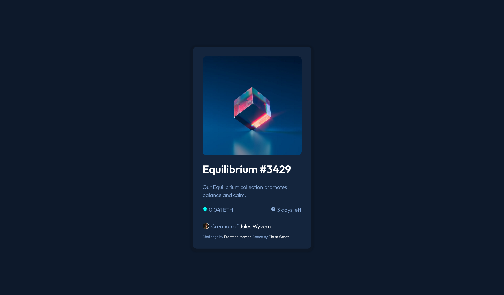

# Frontend Mentor - NFT preview card component solution

This is a solution to the [NFT preview card component challenge on Frontend Mentor](https://www.frontendmentor.io/challenges/nft-preview-card-component-SbdUL_w0U). 

## Table of contents

  - [The challenge](#the-challenge)
  - [Screenshot](#screenshot)
  - [Links](#links)
  - [Built with](#built-with)
  - [What I learned](#what-i-learned)
  - [Continued development](#continued-development)
  - [Ressources](#ressources) 
- [Author](#author)


### The Challenge

Users should be able to:

- View the optimal layout depending on their device's screen size
- See hover states for interactive elements

### Screenshot



### Links

- Solution URL: [https://christ-kevin.github.io/NFTchallenge/]

### Built with

- Semantic HTML5 markup
- CSS custom properties
- Flexbox

### What I learned

```html

```


```css
     .proud-of-these-css {
 
     }

```

### Ressources 

- Chris Coyier - [Links in headers or headers in links](https://css-tricks.com/link-header-header-link/)
- W3C. Wai - [An alt decision tree ](https://css-tricks.com/link-header-header-link/)

### Continued development

- mobile first when styling the html
- responsive web design with css


## Author

- LinkedIn - [Christ Watat](https://www.linkedin.com/in/christ-k%C3%A9vin-touga-watat-32026712a?lipi=urn%3Ali%3Apage%3Ad_flagship3_profile_view_base_contact_details%3B8kg%2Bc3nQSpeLtRN4etFyNA%3D%3D)
- Frontend Mentor - [@Christ-Kevin](https://www.frontendmentor.io/profile/Christ-Kevin)
- Twitter - [@WatatK](https://twitter.com/christkevdev)
